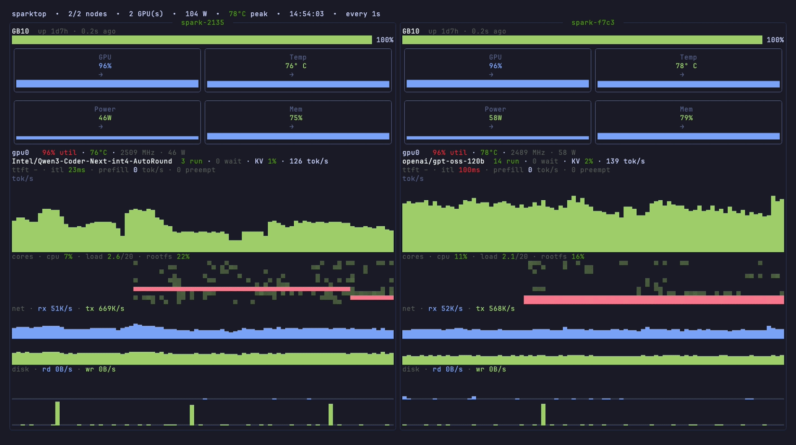

<div align="center">

# sparktop

**A DGX Spark TUI that takes the heat.**

[](https://github.com/galaxy-io/sparktop/releases)
[](LICENSE)
[](go.mod)

A terminal dashboard for small **NVIDIA DGX Spark** clusters - host, GPU, and
**vLLM inference** metrics for every node, live. No Prometheus, no Grafana,
no browser.



</div>

Built with [`dado`](https://github.com/atterpac/dado) (a `tcell`-based TUI
toolkit). Inspired by [paul-aviles/NVIDIA-DGX-Spark-Dashboard](https://github.com/paul-aviles/NVIDIA-DGX-Spark-Dashboard).

## Features

### Cluster at a glance
- Top bar aggregates the fleet: nodes up, GPU count, total power draw, peak GPU temperature
- Per-node **health score** (0-100) folding in CPU, memory, disk, thermal, and throttle pressure
- Nodes that stop responding flip to `DOWN` with the error and recover automatically - outages render as dips in the timelines, not blank charts

### GPU, tuned to the GB10
- 2×2 KPI cards - **util, temp, power, unified memory %** - each with a trend arrow and a full-width sparkline, thresholds tuned to the GB10 envelope (temp warns at 80 °C, power at 110 W, memory at 80 %)
- A red **`THROTTLING`** badge when a busy GPU's SM clock sags below its observed peak - the tell for thermal/power throttling
- Memory is shown once, unified: on GB10, "VRAM" and system RAM are the same physical LPDDR5X pool

### vLLM serving
- Served model, **running/waiting** request counts (waiting turns yellow: backpressure), **KV-cache %**, and live **generation tok/s** as a solid block-area chart
- A latency detail line derived from vLLM's histograms, averaged over each poll window:
  - **TTFT** - time-to-first-token, what a user feels before streaming starts
  - **ITL** - inter-token latency, the streaming smoothness
  - **prefill tok/s** - prompt-ingest load
  - **preemptions** - anything above zero means the KV cache is thrashing

### Host
- **Core × time heatmap** - every core's utilization history in one dense map (idle fades to the background, load walks green → yellow → red)
- Host pressure line: CPU %, load vs. core count, root filesystem %
- **Network rx/tx** and **disk read/write** as stacked block-bar bands with live rates

### Zero infrastructure
- Scrapes `node_exporter`, NVIDIA `dcgm-exporter`, and vLLM's `/metrics` over plain HTTP
- Built-in `deploy` / `teardown` / `health` subcommands manage the exporter containers over SSH
- 26 built-in themes, switchable at runtime

## Installation

### Homebrew (macOS & Linux)

```bash
brew install galaxy-io/tap/sparktop
```

### go install

```bash
go install github.com/galaxy-io/sparktop/cmd/sparktop@latest
```

### Prebuilt binaries

Every release ships `linux`/`darwin`/`windows` × `amd64`/`arm64` archives and
a Debian package on the [releases page](https://github.com/galaxy-io/sparktop/releases) -
the `.deb` installs cleanly on the DGX Spark nodes themselves.

### From source

Needs Go 1.25+ and [Task](https://taskfile.dev). Builds anywhere - your
laptop, or one of the Spark nodes.

```bash
git clone https://github.com/galaxy-io/sparktop.git
cd sparktop
task build            # → ./sparktop          (or: go build -o sparktop ./cmd/sparktop)
task build-arm        # → ./sparktop-linux-arm64, for the DGX Spark nodes
```

## Quick start

### 1. Run the exporters on each DGX Spark node

These are the only things that run *on* the nodes (two small containers).
Prereqs per node: Docker + Compose plugin, and the NVIDIA Container Toolkit
(DGX OS ships with it; otherwise see the
[install guide](https://docs.nvidia.com/datacenter/cloud-native/container-toolkit/latest/install-guide.html);
verify with `docker run --rm --gpus all ubuntu nvidia-smi`).

From your workstation:

```bash
sparktop deploy me@spark-01 me@spark-02
```

This SSHes to each target, uploads the embedded `docker-compose.yml`
(`internal/exporters/docker-compose.yml` in this repo, if you'd rather deploy
by hand), pulls the images, and brings the stack up. Then check reachability:

```bash
sparktop health spark-01 spark-02
```

Tear it down later with `sparktop teardown me@spark-01 me@spark-02`
(add `--purge` to also remove `~/sparktop-exporters` on each node).

### 2. Run the dashboard

No config file needed to try it:

```bash
sparktop -nodes spark-01=192.168.1.101,spark-02=192.168.1.102
# serving LLMs? add the vLLM metrics port:
sparktop -nodes spark-01=192.168.1.101,spark-02=192.168.1.102 -vllm-port 8000
```

For everyday use, create a config once and then plain `sparktop` works:

```bash
mkdir -p ~/.config/sparktop
curl -fsSL https://raw.githubusercontent.com/galaxy-io/sparktop/main/config.yaml.example \
  -o ~/.config/sparktop/config.yaml
$EDITOR ~/.config/sparktop/config.yaml    # put your node IPs in it
sparktop
```

## Usage

### Keybindings

| Key | Action |
|-----|--------|
| `r` | Refresh now |
| `t` | Cycle theme (26 built-in `dado` themes) |
| `q` / `Ctrl-C` | Quit |

### Flags

Each flag overrides the config file:

| Flag | Description |
|------|-------------|
| `-config <file>` | Explicit config file path |
| `-nodes name=host,…` | Comma-separated node list |
| `-interval 2s` | Poll cadence |
| `-theme <name>` | Theme name |
| `-vllm-port 8000` | Scrape vLLM `/metrics` on this port for every node (use per-node `vllm_port:` in the config for mixed setups) |

## Configuration

`sparktop` looks for a config file in this order; the first that exists wins:

1. `-config <path>` (explicit override)
2. `$XDG_CONFIG_HOME/sparktop/config.yaml`
3. `~/.config/sparktop/config.yaml`  ← recommended
4. `~/.sparktop/config.yaml`         ← legacy
5. `./config.yaml`                   ← dev convenience

Schema (see [`config.yaml.example`](config.yaml.example)):

```yaml
interval: 1s              # poll cadence; 1s is fine over a LAN/Tailscale
timeout: 10s              # per-scrape budget (default: max(5s, 4×interval), ≤30s)
history: 60               # minimum points kept per chart (charts keep at least a screenful)
theme: tokyonight-night   # optional; any built-in dado theme
nodes:
  - name: spark-01
    host: 192.168.1.101
    vllm_port: 8000       # scrape vLLM /metrics: tok/s, queue depth, KV-cache, latency
  - name: spark-02
    host: 192.168.1.102
    # node_port: 9100     # override if the exporters aren't on the defaults
    # gpu_port: 9400
```

## CLI

`sparktop` is one binary with subcommands; the dashboard runs by default.

```text
sparktop                              # dashboard (= sparktop dashboard)
sparktop deploy   me@spark-01 ...     # upload + bring up the exporter stack
sparktop teardown me@spark-01 ...     # stop the stack (--purge removes ~/sparktop-exporters)
sparktop health   spark-01 ...        # probe TCP + /metrics on :9100 and :9400
sparktop version
sparktop help
```

`deploy` and `teardown` shell out to the system `ssh`, so your `~/.ssh/config`,
agent, and known hosts all work as you'd expect.

## Why sparktop

The DGX Spark's GB10 superchip shares one ~128 GB unified LPDDR5X pool between
the Grace CPU and the Blackwell GPU. That changes what monitoring matters:
memory pressure is a *node* problem (an over-eager vLLM config can hard-lock
the box, not just OOM the process), and thermal/power throttling on the compact
chassis quietly eats your tok/s. sparktop is built around exactly those
signals - unified memory %, GPU temp/power against the GB10 envelope, SM-clock
throttle detection, and live vLLM serving stats - without standing up a
Prometheus stack for a two-node cluster.

## Architecture

| Path | What it is |
|---|---|
| `cmd/sparktop/` | the binary entrypoint (subcommand router) |
| `internal/cli/` | subcommands: `dashboard`, `deploy`, `teardown`, `health`, `version` |
| `internal/config/` | config file + flag parsing |
| `internal/metrics/` | HTTP scrape + Prometheus-text parser + per-node snapshots/rates |
| `internal/ui/` | the `dado` dashboard |
| `internal/exporters/docker-compose.yml` | `node_exporter` + `dcgm-exporter` stack - embedded in the binary |
| `Taskfile.yml` | `task build`, `task test`, … (needs [Task](https://taskfile.dev)) |
| `.goreleaser.yaml` | release builds, the `.deb`, and the Homebrew tap cask |

## Notes

- **DGX Spark is ARM64.** The exporter images (`prom/node-exporter`,
  `nvcr.io/nvidia/k8s/dcgm-exporter`) publish `linux/arm64`, and
  `task build-arm` cross-compiles the TUI for the nodes too.
- **GPU metrics refresh.** `dcgm-exporter` collects on its own internal
  interval (coarse by default) - set `DCGM_EXPORTER_INTERVAL=1000` on the node
  if you want GPU metrics to actually move every second.
- **`dcgm-exporter` GPU access.** The compose file uses the
  `deploy.resources.reservations.devices` syntax; swap it for `runtime: nvidia`
  if your Docker is set up the older way.
- **No GPU metrics?** If `dcgm-exporter` can't enumerate the GB10 on your DGX
  OS build, the dashboard shows "no GPUs reported" for that node and keeps
  working on host metrics.
- **Firewall.** The host running `sparktop` must reach `tcp/9100` and
  `tcp/9400` (and your vLLM port, if configured) on each node.
- **Trade-offs vs. Prometheus + Grafana:** same exporters, same metrics, but no
  long-term history (charts hold the last screenful of samples), no alerting,
  and it's local to your terminal rather than a shared web UI.

## Roadmap

- A per-node drill-down view (full-screen, more panels)
- Threshold coloring + an alerts pane (GPU temp, disk full, node down)
- Optional on-disk history so charts survive a restart
- Mouse/scroll for picking a node

## Acknowledgments

- [`dado`](https://github.com/atterpac/dado) - the TUI toolkit sparktop is built on
- [paul-aviles/NVIDIA-DGX-Spark-Dashboard](https://github.com/paul-aviles/NVIDIA-DGX-Spark-Dashboard) - the original inspiration
- [`node_exporter`](https://github.com/prometheus/node_exporter) and [`dcgm-exporter`](https://github.com/NVIDIA/dcgm-exporter) - the metrics sources
